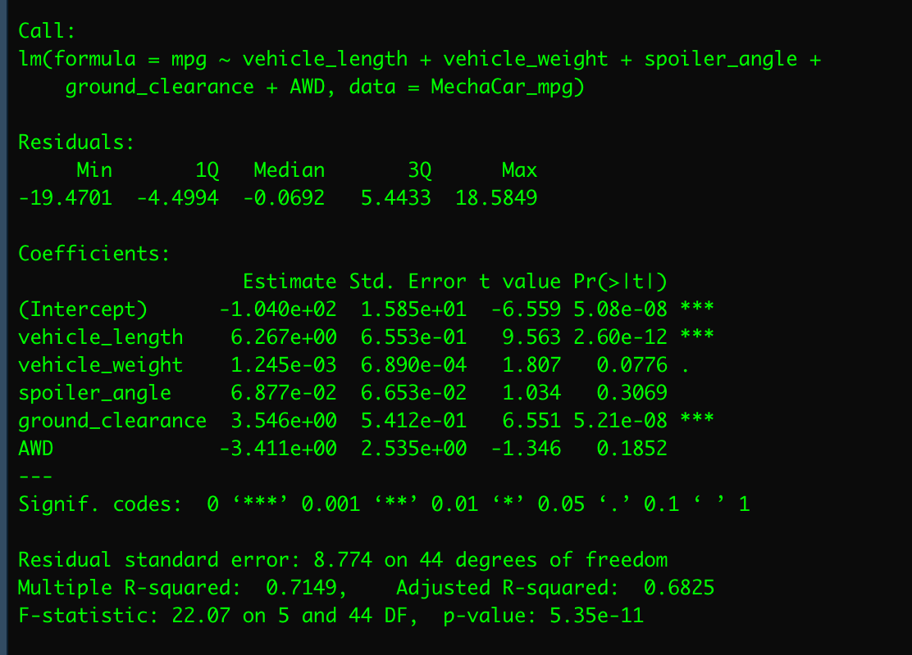
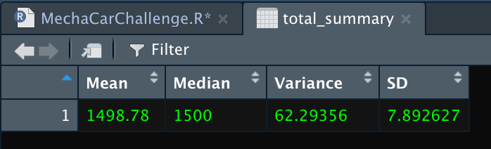
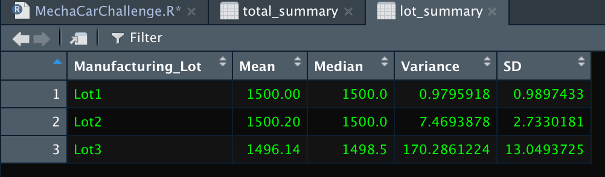
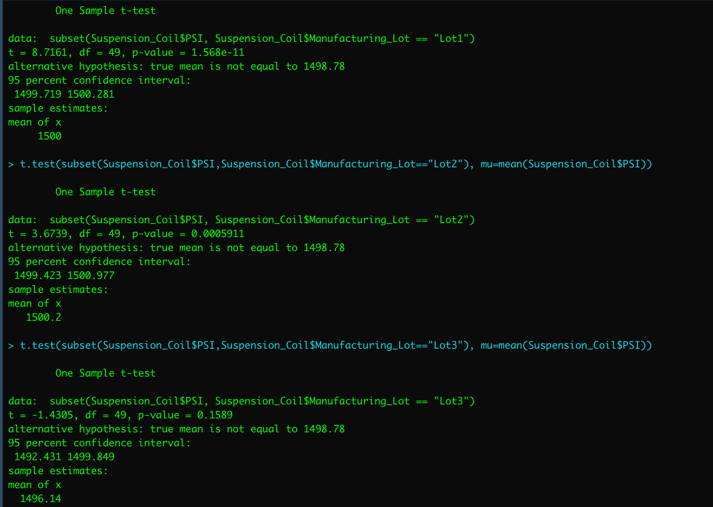
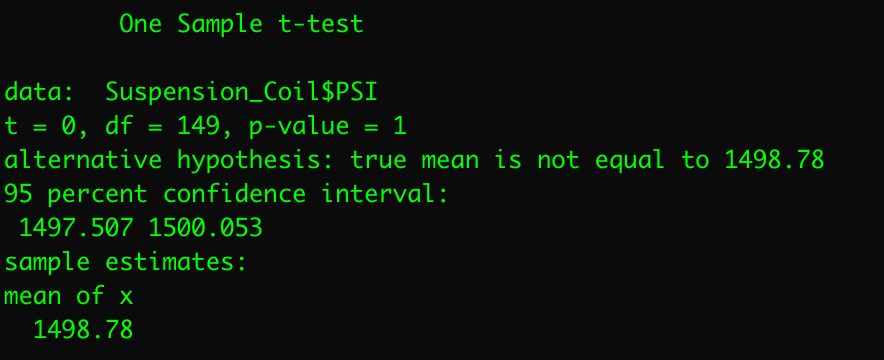

# MechaCar_Statistical_Analysis

## Linear Regression to Predict MPG

### Which variable/coefficients provided a non-random amount of variance to hte mpg values in the dataset?
There non-random amounts of variance provided by the mpg values. 

### Is the slope of the linear model considered to be zero? Why or why not?
The slope of the linear model is not considered to be zero. The multiple linear regression formula for mpg = -.01 + 6.267(vehicle length)+.001(vehicle weight)+.069(spoiler angle)+3.546(ground clearance)-3.411(AWD). This results in a non-zero slope.

### Does this linear model predict mpg of MechaCar prototypes effectively? Why or why not?
This dataset does predict mpg og MechaCar prototypes effectively. R-squared is .7149, a strong correlation. 

 
## Summary Statistics on Suspension Coils

### The design specifications for the MechaCar suspension coils dictate that the variance of the suspension coils must not exceed 100 pounds per square inch. Does the current manufacturing data meet this design specification for all manufacturing lots in total and each lot individually? Why or why not?
The total manufacturing lot variance is 62, meeting the design specifications of not exceeding 100 pounds per square inch. However, Lot 3 has a high variance of 170, exceeding 100 pounds per square inch ad does not meet the design specifications. Lots 1 and 2 have a lower variance.

## T-Tests on Suspension Coils
### Briefly summarize your interpretation and findings for the t-test results

**T-test for all Lots**
All Manufacturing Lots: p-value = .6028, alpha = .05
            .60 > .05, the total manufacturing lot is not statistically significant
            

**T-test for Lot 1**
Lot 1: p-value = 1, alpha = .05
            1 > .05, Lot 1 is not statistically significant 
**T-test for Lot 2**
Lot 2: p-value = .6072, alpha = .05
            .60 > .05, Lot 2 is not statistically significant
**T-test for Lot 3**
Lot 3: p-value = .04168, alpha = .05
            .04 < .05, Lot 3 is statistically significant
The overall manufacturing, Lot 1, and Lot 2 show a normal distribution. Therefore, there is not sufficient evidence to reject the null hypothesis, which shows the two means are statistically similar.

## Study Design: MechaCar vs Competition
    Write a short description of a statistical study that can quantify how the MechaCar performs against the competition. In your study design, think critically about what metrics would be of interest to a consumer: for a few examples, cost, city or highway fuel efficiency, horse power, maintenance cost, or safety rating.
    - In your description, address the following questions:
    - What metric or metrics are you going to test?
    - What is the null hypothesis or alternative hypothesis?
    - What statistical test would you use to test the hypothesis? And why?
    - What data is needed to run the statistical test?
